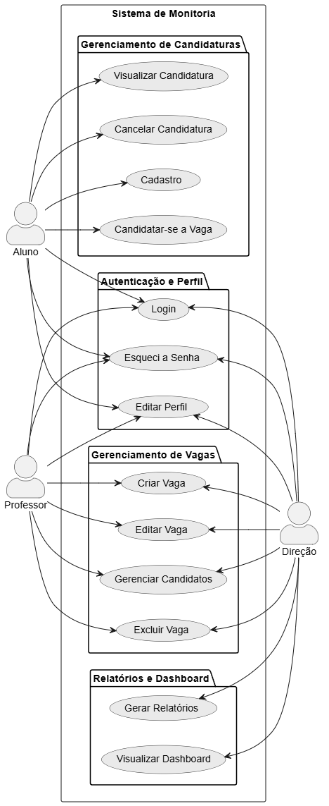

# 📌 Diagrama de Casos de Uso

## 🧩 Casos de Uso Gerais

- Editar perfil
- Esqueci a senha
- Login

### 👨‍🎓 Aluno

- Cadastro
- Editar perfil
- Esqueci a senha
- Login
- Candidatar-se a vagas
- Visualizar candidatura (aceito/recusado)
- Cancelar candidatura

### 👨‍🏫 Professor

- Criar vagas
- Editar vagas
- Gerenciar candidatos
- Excluir vagas

### 🏛️ Direção

- Gerar relatórios
- Dashboard analítico

---

## 🔐 Caso de Uso: Login no Sistema

**Ator:** Aluno, Professor, Direção  
**Descrição:** Permite que o usuário acesse o sistema utilizando suas credenciais.  
**Pré-condição:** O usuário deve possuir uma conta cadastrada.

### Fluxo Principal

1. O usuário acessa a tela de login.
2. O sistema exibe os campos para email institucional e senha.
3. O usuário insere seu email e senha e confirma.
4. O sistema valida as credenciais.
5. O usuário é autenticado e redirecionado para a dashboard principal de seu perfil.

### Fluxos Alternativos

- **3a - Credenciais Inválidas:** O sistema exibe uma mensagem de erro e solicita que o usuário tente novamente.
- **3b - Esqueci a Senha:** O usuário seleciona "Esqueci a senha" e é redirecionado para o fluxo de recuperação.

**Pós-condição:** O usuário está autenticado e tem acesso às funcionalidades do sistema de acordo com seu perfil.  
**Regras de Negócio:** O email informado deve ser institucional da Ibmec.

---

## 🔄 Caso de Uso: Recuperar Senha

**Ator:** Aluno, Professor, Direção  
**Descrição:** Permite que o usuário redefina sua senha caso a tenha esquecido.  
**Pré-condição:** O usuário deve possuir um email cadastrado no sistema.

### Fluxo Principal

1. O usuário seleciona "Esqueci minha senha" na tela de login.
2. O sistema solicita o endereço de email cadastrado.
3. O usuário informa o email institucional e confirma.
4. O sistema envia um link de redefinição de senha para o email.
5. O usuário acessa o link via email e define uma nova senha.
6. O sistema confirma a alteração e redireciona o usuário para a tela de login.

### Fluxos Alternativos

- **3a - Email não encontrado:** O sistema informa que, se o email existir, um link foi enviado para redefinição.

**Pós-condição:** A senha do usuário é alterada e ele pode fazer login com a nova senha.

---

## 📝 Caso de Uso: Editar Perfil

**Ator:** Aluno, Professor, Direção  
**Descrição:** Permite que o usuário visualize e edite suas informações pessoais.  
**Pré-condição:** O usuário deve estar logado no sistema.

### Fluxo Principal

1. O usuário acessa a seção "Meu Perfil".
2. O sistema exibe os dados atuais do usuário em um formulário editável.
3. O usuário altera as informações desejadas (ex: telefone, foto).
4. O usuário salva as alterações.
5. O sistema valida e persiste os novos dados.
6. O sistema exibe uma mensagem de confirmação.

### Fluxos Alternativos

- **4a - Cancelar Edição:** O usuário cancela a operação e retorna à tela anterior sem salvar alterações.

**Pós-condição:** As informações do perfil do usuário são atualizadas no sistema.

---

## 🎯 Caso de Uso: Candidatar-se a Vaga

**Ator:** Aluno  
**Descrição:** Permite que o aluno se candidate a uma vaga de monitoria aberta.  
**Pré-condição:** O aluno deve estar logado. Deve haver pelo menos uma vaga disponível.

### Fluxo Principal

1. O aluno busca e visualiza uma vaga de monitoria de interesse.
2. O aluno seleciona a opção "Candidatar-se".
3. O sistema exibe um resumo da vaga e solicita confirmação.
4. O aluno confirma a candidatura.
5. O sistema registra a candidatura com status "Pendente".
6. O sistema notifica o professor responsável pela vaga.

### Fluxos Alternativos

- **2a - Critérios de candidatura:** A opção candidatar-se só é visível ao aluno cujo CR na disciplina é > 8, ou de acordo com os critérios do professor.

**Pós-condição:** Uma nova candidatura é criada com status "Pendente" e o professor é notificado.  
**Regras de Negócio:**

- Um aluno não pode se candidatar mais de uma vez à mesma vaga.
- O aluno deve ter cursado ou estar cursando a disciplina para a qual está se candidatando.

---

## 🆕 Caso de Uso: Criar Vaga de Monitoria

**Ator:** Professor  
**Descrição:** Permite que o professor publique uma nova vaga de monitoria.  
**Pré-condição:** O professor deve estar logado.

### Fluxo Principal

1. O professor seleciona "Criar Nova Vaga".
2. O sistema exibe um formulário (disciplina, descrição, requisitos, data limite para candidaturas).
3. O professor preenche os dados e publica a vaga.
4. O sistema salva a vaga com status "Ativa" e a disponibiliza para os alunos.

**Pós-condição:** Uma nova vaga de monitoria é criada e visível para os alunos.  
**Regras de Negócio:** A data limite para candidaturas deve ser posterior ao dia da criação da vaga.

---

## 📊 Caso de Uso: Gerar Relatórios

**Ator:** Direção  
**Descrição:** Permite que a direção gere relatórios consolidados sobre as monitorias (ex.: vagas mais procuradas, taxa de aceitação).  
**Pré-condição:** O usuário da direção deve estar logado.

### Fluxo Principal

1. O usuário acessa a seção "Relatórios".
2. O sistema exibe opções de filtros (período, curso, disciplina).
3. O usuário seleciona os filtros desejados e solicita a geração do relatório.
4. O sistema processa os dados e exibe o relatório na tela.
5. O usuário tem a opção de exportar o relatório no modelo que preferir (PDF, XLSX).

**Pós-condição:** Um relatório é gerado com base nos filtros aplicados.

### Diagrama de Caso de Uso

