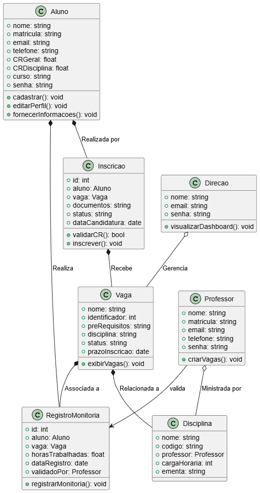

## 📘 Diagrama de Classes

### 🧾 Descrição das Classes

---

### 👨‍🎓 Aluno
**Atributos:**
- Nome  
- Matrícula  
- Email  
- Telefone  
- CR Geral  
- Curso  
- Senha  

**Métodos:**
- `cadastrar()`  
- `editarPerfil()`  

---

### 👨‍🏫 Professor
**Atributos:**
- Nome  
- Matrícula  
- Email  
- Telefone  
- Senha  

---

### 📌 Vaga
**Atributos:**
- Nome  
- Identificador  
- Pré-requisitos  
- Disciplina  
- Status  
- Prazo de Inscrição  

---

### 📖 Disciplina
**Atributos:**
- Nome  
- Código  
- Professor  
- cargaHoraria  
- ementa  

---

### 📝 Candidatura
**Atributos:**
- ID  
- Aluno  
- Vaga  
- Documentos  
- Status  
- Data da Candidatura  

**Métodos:**
- `validarCR()`  

---

### 📒 Registro de Monitoria
**Atributos:**
- ID  
- Aluno  
- Vaga  
- Horas Trabalhadas  
- Data de Registro  
- Validado por  

---

### 🏛️ Direção
**Atributos:**
- Nome  
- Email  
- Senha  

**Métodos:**
- `visualizarDashboard()`  

---

### 📷 Diagrama Visual

